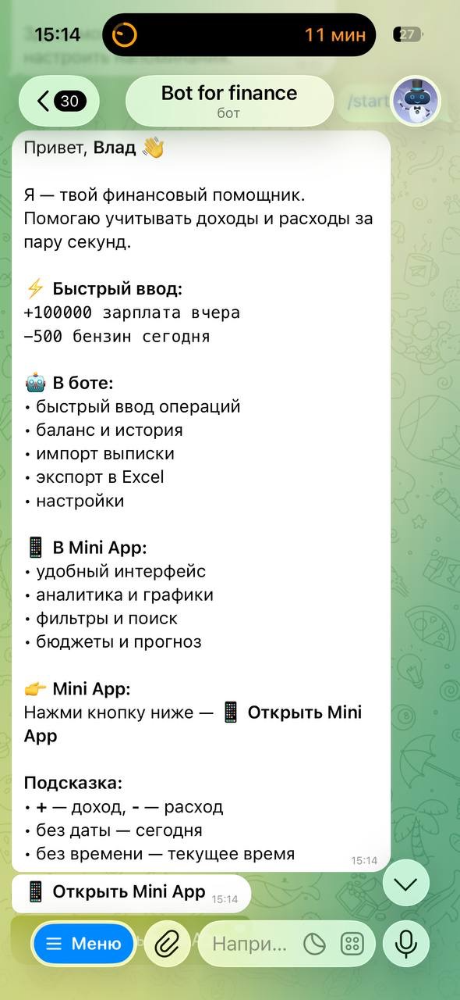
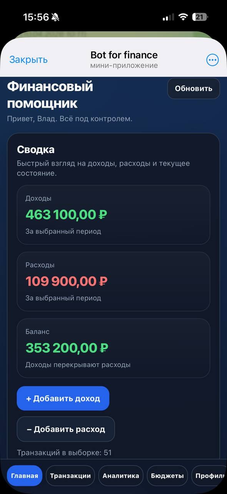
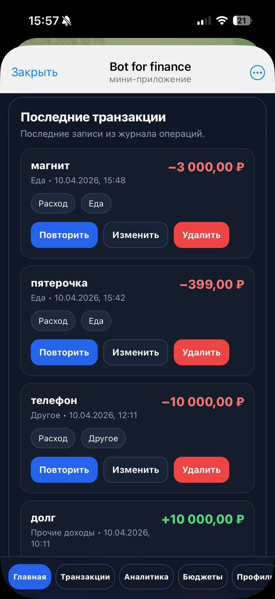
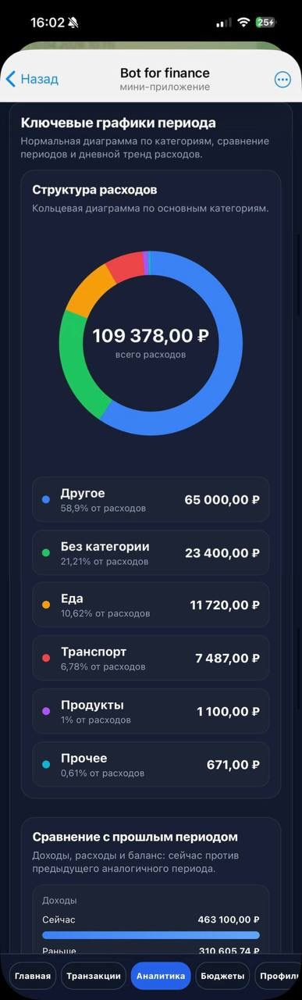
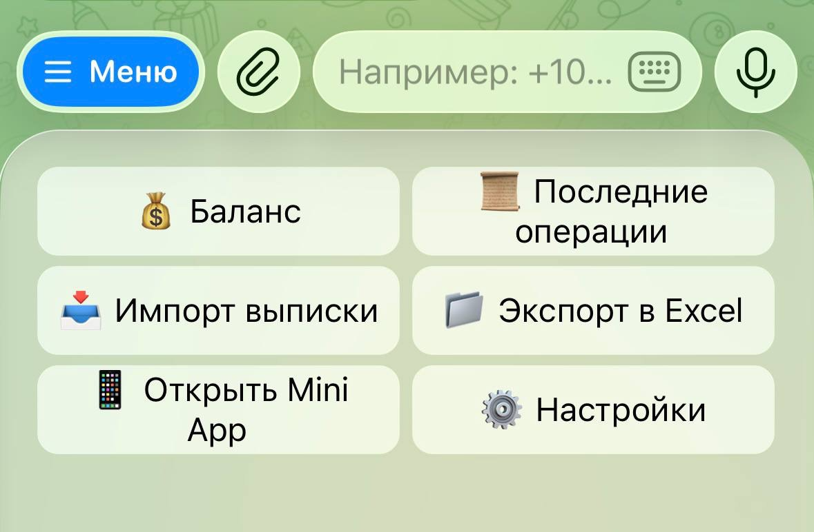
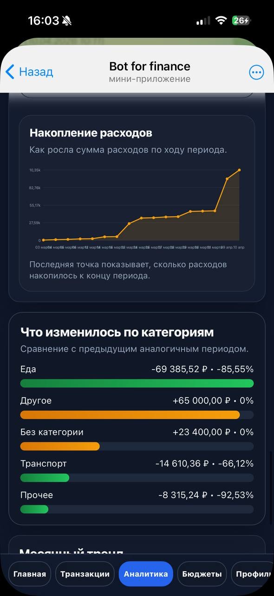
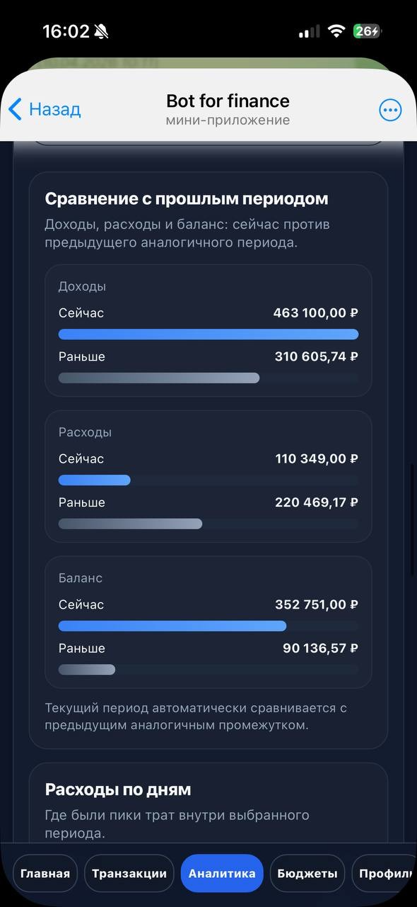
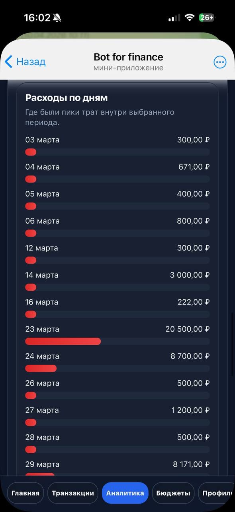
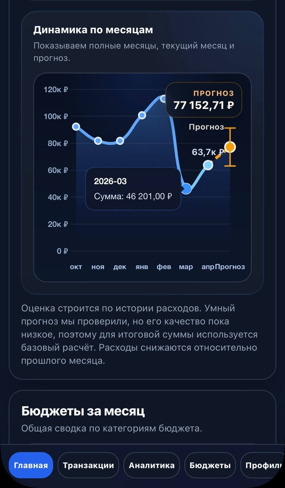

# Personal Finance Assistant

Система для учёта, анализа и прогнозирования личных финансов на базе **Telegram-бота и Telegram Mini App**.

Telegram-бот используется для быстрого добавления операций и повседневных действий, а Mini App — для работы с транзакциями, аналитикой, бюджетами и прогнозом расходов.

## Интерфейс

<p align="center">
  
  &nbsp;
  
  &nbsp;
  
  &nbsp;
  
</p>

<p align="center">
  Telegram-бот · Главная · Транзакции · Аналитика
</p>

### Telegram-бот

<p align="center">
  
</p>

Через Telegram-бота можно быстро добавлять доходы и расходы, смотреть баланс и историю, импортировать банковские выписки и экспортировать данные в Excel.


### Аналитика и прогнозирование

<br>

<p align="center">
  
  &nbsp;
  
  &nbsp;
  
</p>

<p align="center">
  Прогноз расходов · Сравнение периодов · Расходы по дням
</p>

<p align="center">
  
</p>


## Возможности

- учёт доходов и расходов;
- история, поиск и фильтрация транзакций;
- аналитика и графики;
- бюджеты и прогнозирование расходов;
- импорт банковских PDF-выписок;
- экспорт данных в Excel;
- автоматическая категоризация расходов;
- шаблоны операций и напоминания;
- REST API и административная панель.

**Стек:** Python, aiogram 3, Django, Django REST Framework, PostgreSQL, JavaScript, Chart.js, scikit-learn, openpyxl, XlsxWriter.

## Запуск проекта

```bash
git clone https://github.com/Vlad-gw/personal-finance-assistant.git
cd personal-finance-assistant

python3 -m venv .venv
source .venv/bin/activate
pip install -r requirements.txt
