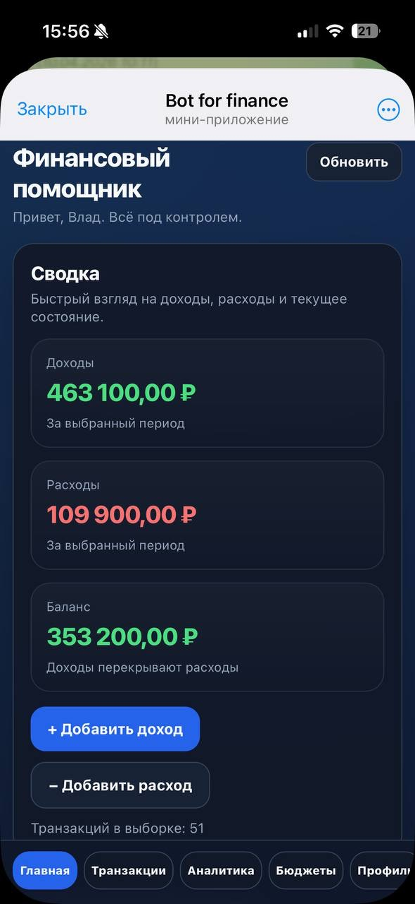
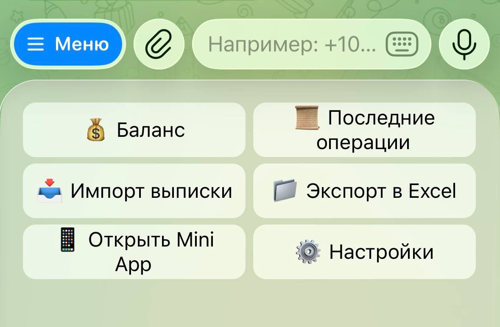

# Personal Finance Assistant

Система для учёта, анализа и прогнозирования личных финансов на базе **Telegram-бота и Mini App**. Бот предназначен для быстрого ввода операций, а Mini App — для работы с историей, аналитикой, бюджетами и прогнозом расходов.

## Интерфейс

### Mini App

<p align="center">
  
  &nbsp;&nbsp;
  
</p>

<p align="center">
  Главная страница и финансовая аналитика
</p>

### Telegram-бот

<p align="center">
  
</p>

<p align="center">
  Быстрый ввод операций, баланс, история, импорт выписок и экспорт в Excel
</p>
## Возможности

- учёт доходов и расходов, история и фильтрация операций;
- быстрый ввод через Telegram-бота;
- аналитика, графики и бюджеты в Mini App;
- импорт банковских PDF-выписок и экспорт данных в Excel;
- автоматическая категоризация расходов и прогнозирование;
- REST API, профиль пользователя, напоминания и административная панель.

**Стек:** Python, aiogram 3, Django, Django REST Framework, PostgreSQL, JavaScript, Chart.js, scikit-learn, openpyxl, XlsxWriter.

## Запуск

```bash
git clone https://github.com/Vlad-gw/personal-finance-assistant.git
cd personal-finance-assistant

python3 -m venv .venv
source .venv/bin/activate          # Windows: .venv\Scripts\activate

pip install -r requirements.txt
pip install -r web/requirements.txt
